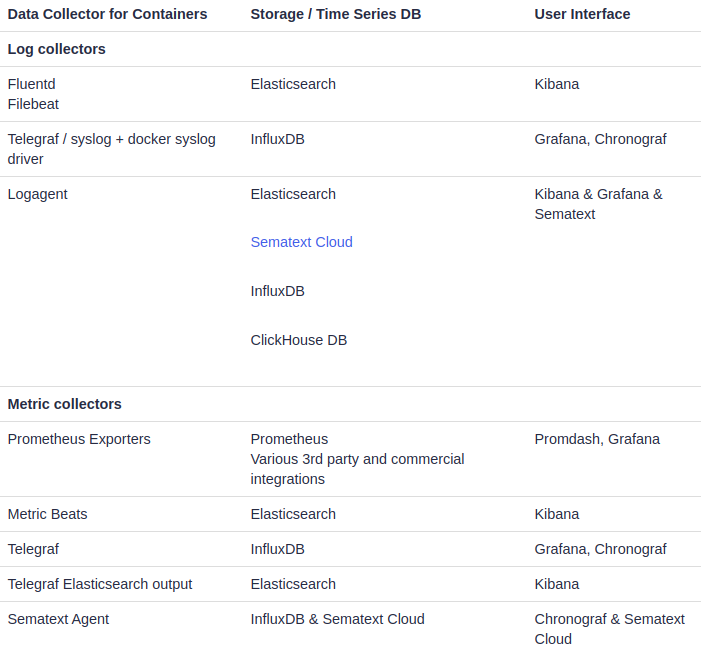

## Local Swarm and Keys management

### Traefik
**CAVEATS**
* [Traefik is a layer 7 reverse proxy](https://docs.traefik.io/)
* [Docker Terraform provider](https://www.terraform.io/docs/providers/docker/index.html) not stable, so `docker stack deploy` used for swarm stacks deploy

##### Articles
* [Traefik 2.0 & Docker 101](https://containo.us/blog/traefik-2-0-docker-101-fc2893944b9d/)  
* [traefik-forward-auth README examples for Traefik 2](https://github.com/thomseddon/traefik-forward-auth/issues/74)
* [MKCERT: valid HTTPS Certificates For localhost](https://blog.filippo.io/mkcert-valid-https-certificates-for-localhost/)
* [Docker Swarm CI deployment using Ansible and Jenkins](https://medium.com/@adrian.gheorghe.dev/docker-swarm-ci-deployment-using-ansible-and-jenkins-ddfc99296db8)

### Keys

- [AWS KMS](https://aws.amazon.com/kms/pricing/) (Hardware) $1 per month. $0.03 per 10,000 requests, free tier of 20,000 requests/month
- [GCloud KMS](https://cloud.google.com/kms/pricing) (Hardware) $1 per month. $0.03 per 10,000 operations
- GCloud KMS (Software) $0.06 per month. $0.03 per 10,000 operations

##### Articles

[Vault vs. Amazon KMS](https://www.vaultproject.io/docs/vs/kms.html)
[How to manage secrets with Mozilla SOPS](https://poweruser.blog/how-to-encrypt-secrets-in-config-files-1dbb794f7352?gi=47a33348fa5)

### Docker Troubleshooting

`docker service ls`

`docker service ps traefic`

`docker service logs traefic`

`sudo journalctl -fu docker.service`

##### Articles
- [Docker Logging: A Complete Guide](https://sematext.com/guides/docker-logs/)

### DNS
Setup can be done like [this](https://askubuntu.com/questions/1029882/how-can-i-set-up-local-wildcard-127-0-0-1-domain-resolution-on-18-04?rq=1)

For IP of docker network see `ifconfig`

Modify:
- Edit `/etc/NetworkManager/dnsmasq.d/example.com-wildcard.conf` string `address=/.th.is/172.21.0.1`
- `sudo systemctl reload NetworkManager`  

##### Monitoring

  
from [Docker Container Monitoring Open Source Tools](https://sematext.com/blog/open-source-docker-monitoring-logging/)

[Swarmprom Prometheus, Grafana, cAdvisor, Node Exporter, Alert Manager and Unsee.](https://github.com/stefanprodan/swarmprom)

[Prometheus, Grafana, cAdvisor, Node Exporter](https://github.com/imixs/imixs-cloud/tree/master/management/monitoring)

https://blog.ruanbekker.com/blog/2019/09/05/deploy-a-monitoring-stack-on-docker-swarm-with-grafana-and-prometheus/

https://itnext.io/docker-swarm-monitoring-4dfe88c72d56?  
https://github.com/opvizordz/docker-swarm-monitor

https://www.influxdata.com/blog/how-to-setup-influxdb-telegraf-and-grafana-on-docker-part-1/

